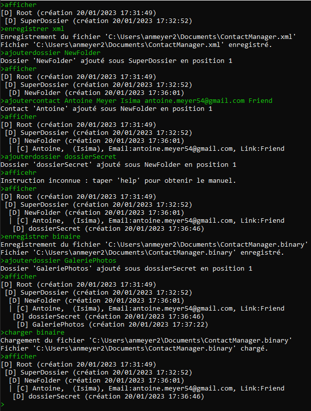
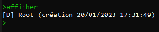
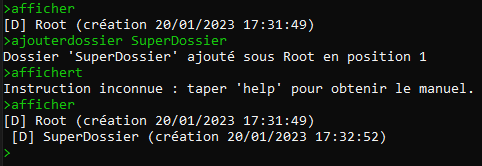
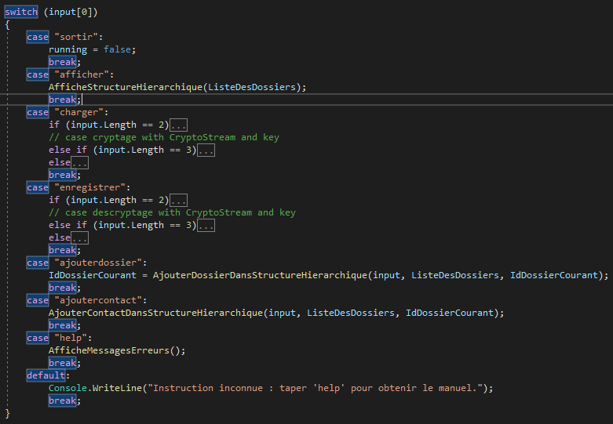
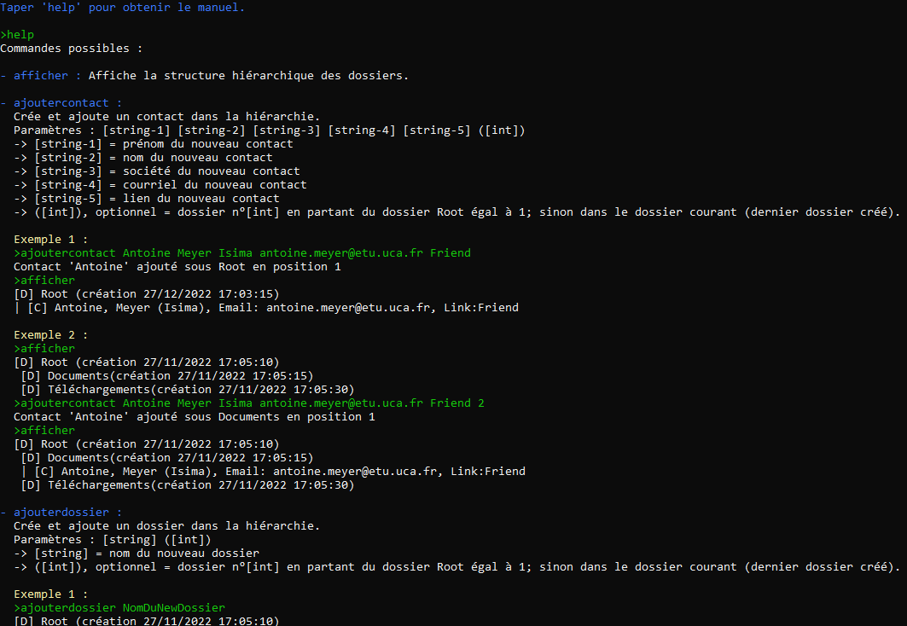
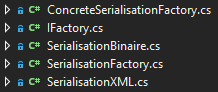
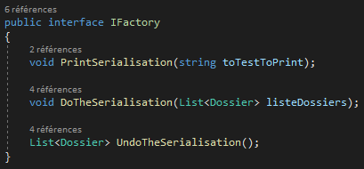
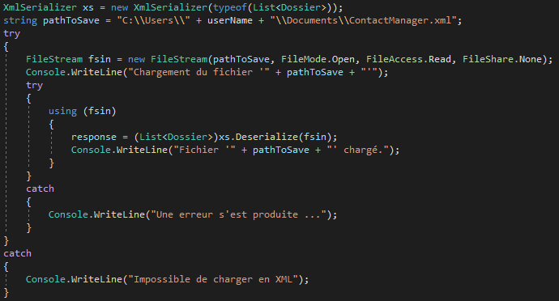
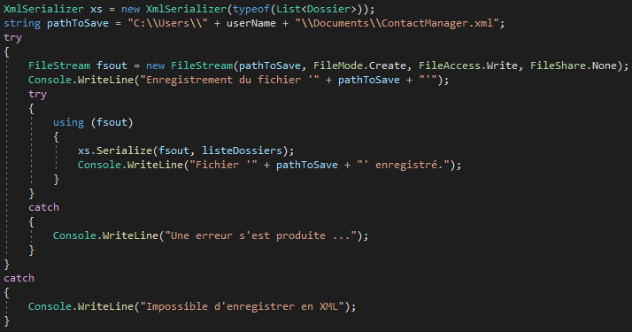
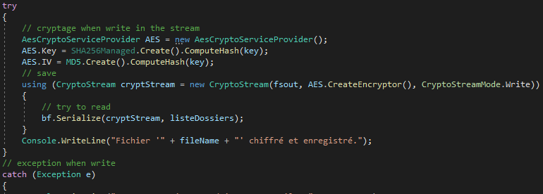

## Développement .NET C# | TP Noté - Programmation ContactManager

**Enseignant :** Maxence LAURENT

**Années :** 2022 - 2023

**Sujet :** *ISIMA_Développement-Dotnet-Csharp_2022-2023 -TP-Noté.pdf*

**Résumé :** Réaliser une application qui fait une gestion de contacts. L'application est en trois grandes parties : le socle applicatif, la gestion de la persistance des données et la protection par chiffrage de ces données.

**GitFlow:** J'ai travaillé et versionné mon travail avec la technologie Git et l'outil GitHub. J'ai réalisé des `Issues` afin de cadrer mon travail.

---

## Sommaire

=> [Exemple d'exécution](#exemple-dexécution)

I. [Présentation pour le rendu](#présentation-pour-le-rendu)
1. [Ma solution](#ma-solution) 2. [Mes choix techniques](#mes-choix-techniques) 3. [Mes problèmes rencontrés ](#mes-problèmes-rencontrés) 4. [Ma résolution des problèmes](#ma-résolution-des-problèmes)

II. [Socle applicatif](#socle-applicatif)
1. [Description](#description) 2. [Points réalisés](#points-réalisés) 3. [Points intéréssants](#points-intéréssants)

III. [Sérialisation](#sérialisation)
1. [Description](#description-1) 2. [Points réalisés](#points-réalisés-1) 3. [Points intéréssants](#points-intéréssants-1)

IV. [Chiffrage](#chiffrage)
1. [Description](#description-2) 2. [Points réalisés](#points-réalisés-2) 3. [Points intéréssants](#points-intéréssants-2)

---

## Présentation pour le rendu

### Ma solution

```bash
    Taper 'help' pour obtenir le manuel.
```

Ma solution a quatre projets :

1. Cryptage

Réalise la protection du contenu par chiffrage. Plus de détails : [ici](#chiffrage)

2. Serialisation

Réalise la gestion de la persistance par sérialisation binaire et XML. Plus de détails : [ici](#sérialisation)

3. SocleApplicatif

Le programme principal à exécuter se trouve dans ce projet : c'est le `main`. Il utilise les autres projets pour créer la solution globale. Plus de détails : [ici](#socle-applicatif)

4. Utilities

Projet permettant de regrouper les classes, objets et autres méthodes utiles pour le reste de l'application.

### Mes choix techniques

J'utilise le langage `C#` ainsi que le framework Windows `.NET Core`. Ma `Structure De Données (SDD)` pour la gestion des `Dossier` et des `Contact` est la suivante : une liste de `Dossier`, chaque `Dossier` contenant une liste `Dossier` ou de `Contact`.

Je n'ai **pas fait** de classe `Node` par exemple, dont auraient hérité `Dossier` et `Contact` car j'ai fait face à des problèmes lors de la sérialisation avec ce patron de conception ([détails](#mes-problèmes-rencontrés)). Cette conception est mieux au niveau SDD mais dans mon cas elle a posé des problèmes donc j'ai opté pour une SDD plus lourde mais tout aussi fonctionnel !

### Mes problèmes rencontrés 

Premièrement le **choix de la SDD** ([détails](#mes-choix-techniques)).

En second point vient la **recherche de documentation**. Beaucoup de notions étaient nouvelles et cela m'a poussé à aller trouver et lire la documentation Windows. Ce n'est pas vraiment un problème mais cette recherche documentaire a pris pas mal de temps et de réfléxion pour faire les bons choix et une bonne utilisation des nouvelles notions.

### Ma résolution des problèmes

Du temps, de la résilience, la BU (Bibliothèque Universitaire) et l'utilisation de Google ou autres moteurs de recherche en ligne.

### Exemple d'exécution



---

## Socle applicatif

### Description

Structure de données et gestion basique

### Points réalisés

Tous les points initiaux du sujet ont été réalisé ainsi que les points pour aller plus loin. Ma solution nommée `Utilities` contient ainsi :

* un modèle de données pour gérer des objets `Contact` et leurs rangements dans une structure hiérarchique d'objet `Dossier`

* un affichage pour toute la structure

    

* une gestion des dossiers et des contacts

    

* la gestion du format d'adresse mail

* la possibilité de créer des éléments dans un parent choisi

### Points intéréssants

* Switch dans la fonction main

    

* Ma commande help

    

---

## Sérialisation

### Description

Gestion de la persistance par sérialisation binaire et XML

### Points réalisés

Tous les points initiaux du sujet ont été réalisé. J'ai fait les deux premiers points sur trois du "pour aller plus loin". Ma solution nommée `Serialisation` :

* Patron de conception Factory

    

### Points intéréssants

* L'interface IFactory

    

* Chargement avec XML

    

* Enregistrement avec XML

    
---

## Chiffrage

### Description

Protection du contenu par chiffrage

### Points réalisés

Tous les points initiaux du sujet ont été réalisé. Je n'ai pas fait le point "pour aller plus loin".

### Points intéréssants

* Chiffrage avec AES

    

